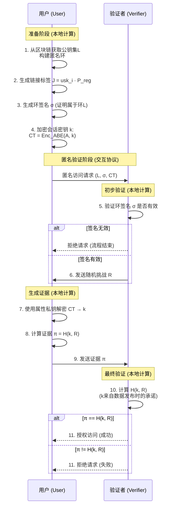

```mermaid
sequenceDiagram
    participant U as 用户 (User)
    participant V as 验证者 (Verifier)

    Note over U: 准备阶段 (本地计算)
    U->>U: 1. 从区块链获取公钥集L<br/>构建匿名环
    U->>U: 2. 生成链接标签 J = usk_i · P_reg
    U->>U: 3. 生成环签名 σ (证明属于环L)
    U->>U: 4. 加密会话密钥 k: <br/>CT = Enc_ABE(A, k)

    Note over U, V: 匿名验证阶段 (交互协议)
    U->>V: 匿名访问请求 (L, σ, CT)

    Note over V: 初步验证 (本地计算)
    V->>V: 5. 验证环签名 σ 是否有效
    alt 签名无效
        V-->>U: 拒绝请求 (流程结束)
    else 签名有效
        V->>U: 6. 发送随机挑战 R
    end

    Note over U: 生成证据 (本地计算)
    U->>U: 7. 使用属性私钥解密 CT → k
    U->>U: 8. 计算证据 π = H(k, R)

    U->>V: 9. 发送证据 π

    Note over V: 最终验证 (本地计算)
    V->>V: 10. 计算 H(k, R) <br/>(k来自数据发布时的承诺)
    alt π == H(k, R)
        V-->>U: 11. 授权访问 (成功)
    else π != H(k, R)
        V-->>U: 11. 拒绝请求 (失败)
    end
```