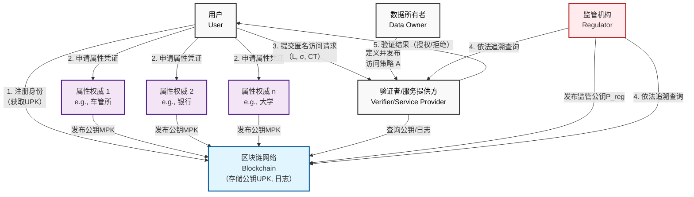

```mermaid
flowchart TD
    %% 定义节点
    U[用户<br>User]
    AA1[属性权威 1<br>e.g., 车管所]
    AA2[属性权威 2<br>e.g., 银行]
    AAn[属性权威 n<br>e.g., 大学]
    BC[区块链网络<br>Blockchain<br/>（存储公钥UPK, 日志）]
    VSP[验证者/服务提供方<br>Verifier/Service Provider]
    DO[数据所有者<br>Data Owner]
    REG[监管机构<br>Regulator]

    %% 定义样式
    classDef entity fill:#f9f9f9,stroke:#333,stroke-width:2px,color:#000
    classDef blockchain fill:#e1f5fe,stroke:#01579b,stroke-width:2px
    classDef authority fill:#f3e5f5,stroke:#4a148c,stroke-width:2px
    classDef regulator fill:#ffebee,stroke:#b71c1c,stroke-width:2px

    class U,DO,VSP entity
    class BC blockchain
    class AA1,AA2,AAn authority
    class REG regulator

    %% 定义连接
    %% 用户交互
    U -- 1. 注册身份<br>（获取UPK） --> BC
    U -- 2. 申请属性凭证 --> AA1
    U -- 2. 申请属性凭证 --> AA2
    U -- 2. 申请属性凭证 --> AAn
    U -- 3. 提交匿名访问请求<br>（L, σ, CT） --> VSP

    %% 属性权威交互
    AA1 -- 发布公钥MPK --> BC
    AA2 -- 发布公钥MPK --> BC
    AAn -- 发布公钥MPK --> BC

    %% 数据所有者交互
    DO -- 定义并发布<br>访问策略 A --> VSP

    %% 验证者交互
    VSP -- 查询公钥/日志 --> BC
    VSP -- 5. 验证结果（授权/拒绝） --> U

    %% 监管机构交互
    REG -- 发布监管公钥P_reg --> BC
    REG -- 4. 依法追溯查询 --> BC
    REG -- 4. 依法追溯查询 --> VSP
```