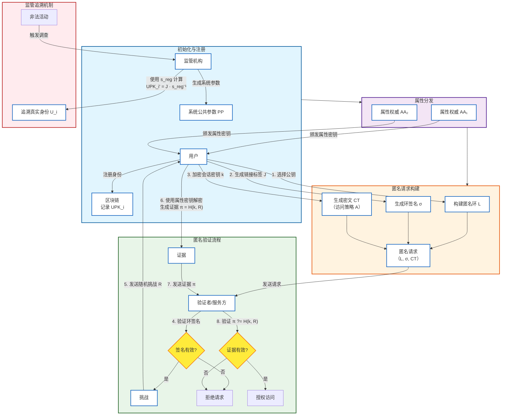

```mermaid
flowchart TD
    classDef registry fill:#e1f5fe,stroke:#01579b,stroke-width:2px
    classDef attribute fill:#f3e5f5,stroke:#4a148c,stroke-width:2px
    classDef request fill:#fff3e0,stroke:#e65100,stroke-width:2px
    classDef verification fill:#e8f5e8,stroke:#1b5e20,stroke-width:2px
    classDef oversight fill:#ffebee,stroke:#b71c1c,stroke-width:2px
    classDef process fill:#ffffff,stroke:#1565c0,stroke-width:2px
    classDef decision fill:#ffeb3b,stroke:#f57f17,stroke-width:2px

    subgraph 初始化与注册
        REG[监管机构] -- 生成系统参数 --> PP[系统公共参数 PP]
        U[用户] -- 注册身份 --> BC[区块链<br>记录 UPK_i]
    end

    subgraph 属性分发
        AA1[属性权威 AA₁] -- 颁发属性密钥 --> U
        AA2[属性权威 AA₂] -- 颁发属性密钥 --> U
    end

    初始化与注册 --> 属性分发

    subgraph 匿名请求构建
        U -- 1. 选择公钥 --> L[构建匿名环 L]
        U -- 2. 生成链接标签 J --> Sigma[生成环签名 σ]
        U -- 3. 加密会话密钥 k --> CT[生成密文 CT<br>（访问策略 A）]
        L --> Req[匿名请求<br>（L, σ, CT）]
        Sigma --> Req
        CT --> Req
    end

    属性分发 --> 匿名请求构建

    Req -- 发送请求 --> V[验证者/服务方]

    subgraph 匿名验证流程
        V -- 4. 验证环签名 --> VerifySig{签名有效?}
        VerifySig -- 是 --> 挑战
        VerifySig -- 否 --> 拒绝[拒绝请求]
        挑战 -- 5. 发送随机挑战 R --> U
        U -- 6. 使用属性密钥解密<br>生成证据 π = H(k, R) --> 证据
        证据 -- 7. 发送证据 π --> V
        V -- 8. 验证 π ?= H(k, R) --> VerifyProof{证据有效?}
        VerifyProof -- 是 --> 授权[授权访问]
        VerifyProof -- 否 --> 拒绝
    end

    subgraph 监管追溯机制
        非法活动 -- 触发调查 --> REG
        REG -- 使用 s_reg 计算<br>UPK_i' = J · s_reg⁻¹ --> 追溯[追溯真实身份 U_i]
    end

    class 初始化与注册 registry
    class 属性分发 attribute
    class 匿名请求构建 request
    class 匿名验证流程 verification
    class 监管追溯机制 oversight
    class REG,PP,U,BC,AA1,AA2,L,Sigma,CT,Req,V,挑战,证据,追溯 process
    class VerifySig,VerifyProof decision
```