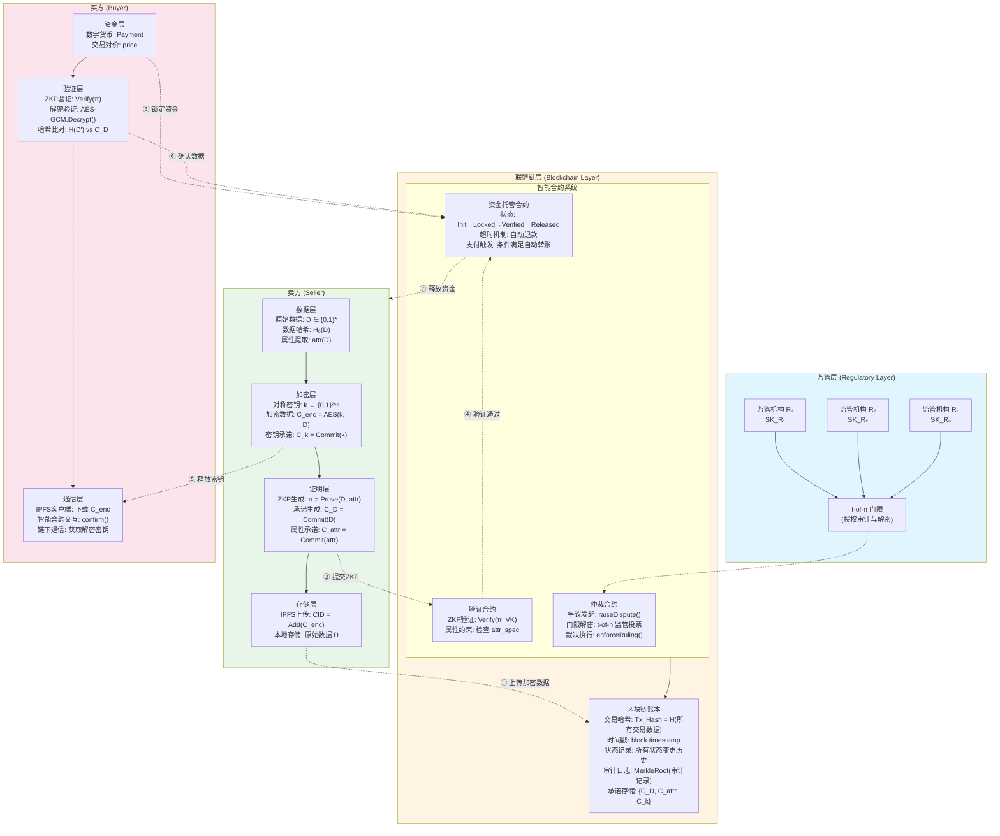

```mermaid
graph TB
    subgraph Regulatory["监管层 (Regulatory Layer)"]
        R1["监管机构 R₁<br/>SK_R₁"]
        R2["监管机构 R₂<br/>SK_R₂"]
        Rn["监管机构 Rₙ<br/>SK_Rₙ"]
        Threshold["t-of-n 门限<br/>(授权审计与解密)"]
        R1 --> Threshold
        R2 --> Threshold
        Rn --> Threshold
    end

    subgraph Blockchain["联盟链层 (Blockchain Layer)"]
        subgraph Contracts["智能合约系统"]
            Escrow["资金托管合约<br/>状态: Init→Locked→Verified→Released<br/>超时机制: 自动退款<br/>支付触发: 条件满足自动转账"]
            Verification["验证合约<br/>ZKP验证: Verify(π, VK)<br/>属性约束: 检查 attr_spec"]
            Arbitration["仲裁合约<br/>争议发起: raiseDispute()<br/>门限解密: t-of-n 监管投票<br/>裁决执行: enforceRuling()"]
        end
        
        Ledger["区块链账本<br/>交易哈希: Tx_Hash = H(所有交易数据)<br/>时间戳: block.timestamp<br/>状态记录: 所有状态变更历史<br/>审计日志: MerkleRoot(审计记录)<br/>承诺存储: {C_D, C_attr, C_k}"]
        
        Contracts --> Ledger
    end

    subgraph Seller["卖方 (Seller)"]
        S_Data["数据层<br/>原始数据: D ∈ {0,1}*<br/>数据哈希: H₀(D)<br/>属性提取: attr(D)"]
        S_Encrypt["加密层<br/>对称密钥: k ← {0,1}²⁵⁶<br/>加密数据: C_enc = AES(k, D)<br/>密钥承诺: C_k = Commit(k)"]
        S_Proof["证明层<br/>ZKP生成: π = Prove(D, attr)<br/>承诺生成: C_D = Commit(D)<br/>属性承诺: C_attr = Commit(attr)"]
        S_Storage["存储层<br/>IPFS上传: CID = Add(C_enc)<br/>本地存储: 原始数据 D"]
        
        S_Data --> S_Encrypt
        S_Encrypt --> S_Proof
        S_Proof --> S_Storage
    end

    subgraph Buyer["买方 (Buyer)"]
        B_Payment["资金层<br/>数字货币: Payment<br/>交易对价: price"]
        B_Verify["验证层<br/>ZKP验证: Verify(π)<br/>解密验证: AES-GCM.Decrypt()<br/>哈希比对: H(D') vs C_D"]
        B_Comm["通信层<br/>IPFS客户端: 下载 C_enc<br/>智能合约交互: confirm()<br/>链下通信: 获取解密密钥"]
        
        B_Payment --> B_Verify
        B_Verify --> B_Comm
    end

    Threshold -.-> Arbitration
    S_Storage -.->|"① 上传加密数据"| Ledger
    S_Proof -.->|"② 提交ZKP"| Verification
    B_Payment -.->|"③ 锁定资金"| Escrow
    Verification -.->|"④ 验证通过"| Escrow
    S_Encrypt -.->|"⑤ 释放密钥"| B_Comm
    B_Verify -.->|"⑥ 确认数据"| Escrow
    Escrow -.->|"⑦ 释放资金"| Seller

    style Regulatory fill:#e1f5ff
    style Blockchain fill:#fff4e1
    style Seller fill:#e8f5e9
    style Buyer fill:#fce4ec

```