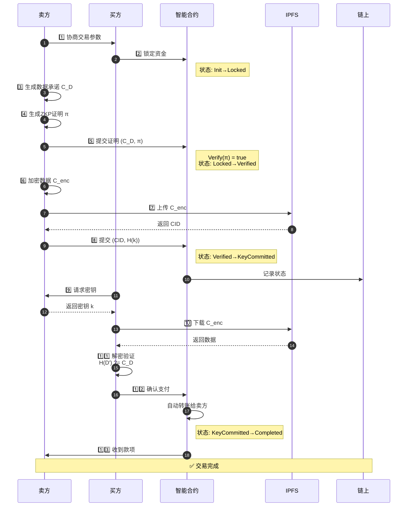

```mermaid
sequenceDiagram
    autonumber
    
    participant 卖方
    participant 买方
    participant 智能合约
    participant IPFS
    participant 链上

    卖方->>买方: 1️⃣ 协商交易参数
    买方->>智能合约: 2️⃣ 锁定资金
    Note right of 智能合约: 状态: Init→Locked
    
    卖方->>卖方: 3️⃣ 生成数据承诺 C_D
    卖方->>卖方: 4️⃣ 生成ZKP证明 π
    卖方->>智能合约: 5️⃣ 提交证明 (C_D, π)
    Note right of 智能合约: Verify(π) = true<br/>状态: Locked→Verified
    
    卖方->>卖方: 6️⃣ 加密数据 C_enc
    卖方->>IPFS: 7️⃣ 上传 C_enc
    IPFS-->>卖方: 返回 CID
    
    卖方->>智能合约: 8️⃣ 提交 (CID, H(k))
    Note right of 智能合约: 状态: Verified→KeyCommitted
    智能合约->>链上: 记录状态
    
    买方->>卖方: 9️⃣ 请求密钥
    卖方-->>买方: 返回密钥 k
    
    买方->>IPFS: 🔟 下载 C_enc
    IPFS-->>买方: 返回数据
    
    买方->>买方: 1️⃣1️⃣ 解密验证<br/>H(D') ?= C_D
    
    买方->>智能合约: 1️⃣2️⃣ 确认支付
    智能合约->>智能合约: 自动转账给卖方
    Note right of 智能合约: 状态: KeyCommitted→Completed
    
    智能合约->>卖方: 1️⃣3️⃣ 收到款项
    
    Note over 卖方,链上: ✅ 交易完成

```