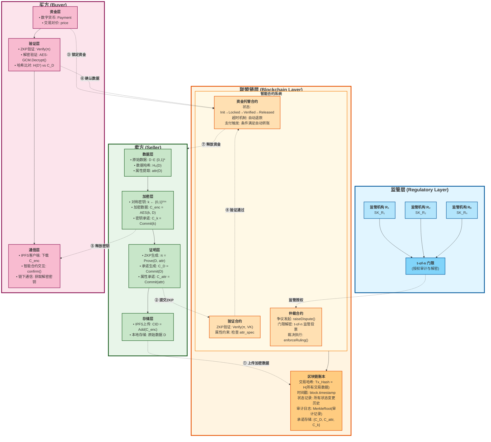

```mermaid
graph TB
    subgraph Regulatory["<font size=5><b>监管层 (Regulatory Layer)</b></font>"]
        R1["<font size=4><b>监管机构 R₁</b><br/>SK_R₁</font>"]
        R2["<font size=4><b>监管机构 R₂</b><br/>SK_R₂</font>"]
        Rn["<font size=4><b>监管机构 Rₙ</b><br/>SK_Rₙ</font>"]
        Threshold["<font size=4><b>t-of-n 门限</b><br/>(授权审计与解密)</font>"]
        R1 --> Threshold
        R2 --> Threshold
        Rn --> Threshold
    end

    subgraph Blockchain["<font size=5><b>联盟链层 (Blockchain Layer)</b></font>"]
        subgraph Contracts["<font size=4><b>智能合约系统</b></font>"]
            Escrow["<font size=4><b>资金托管合约</b><br/>状态: Init→Locked→Verified→Released<br/>超时机制: 自动退款<br/>支付触发: 条件满足自动转账</font>"]
            Verification["<font size=4><b>验证合约</b><br/>ZKP验证: Verify(π, VK)<br/>属性约束: 检查 attr_spec</font>"]
            Arbitration["<font size=4><b>仲裁合约</b><br/>争议发起: raiseDispute()<br/>门限解密: t-of-n 监管投票<br/>裁决执行: enforceRuling()</font>"]
        end
        
        Ledger["<font size=4><b>区块链账本</b><br/>交易哈希: Tx_Hash = H(所有交易数据)<br/>时间戳: block.timestamp<br/>状态记录: 所有状态变更历史<br/>审计日志: MerkleRoot(审计记录)<br/>承诺存储: {C_D, C_attr, C_k}</font>"]
        
        Contracts --> Ledger
    end

    subgraph Seller["<font size=5><b>卖方 (Seller)</b></font>"]
        S_Data["<font size=4><b>数据层</b><br/>• 原始数据: D ∈ {0,1}*<br/>• 数据哈希: H₀(D)<br/>• 属性提取: attr(D)</font>"]
        S_Encrypt["<font size=4><b>加密层</b><br/>• 对称密钥: k ← {0,1}²⁵⁶<br/>• 加密数据: C_enc = AES(k, D)<br/>• 密钥承诺: C_k = Commit(k)</font>"]
        S_Proof["<font size=4><b>证明层</b><br/>• ZKP生成: π = Prove(D, attr)<br/>• 承诺生成: C_D = Commit(D)<br/>• 属性承诺: C_attr = Commit(attr)</font>"]
        S_Storage["<font size=4><b>存储层</b><br/>• IPFS上传: CID = Add(C_enc)<br/>• 本地存储: 原始数据 D</font>"]
        
        S_Data --> S_Encrypt
        S_Encrypt --> S_Proof
        S_Proof --> S_Storage
    end

    subgraph Buyer["<font size=5><b>买方 (Buyer)</b></font>"]
        B_Payment["<font size=4><b>资金层</b><br/>• 数字货币: Payment<br/>• 交易对价: price</font>"]
        B_Verify["<font size=4><b>验证层</b><br/>• ZKP验证: Verify(π)<br/>• 解密验证: AES-GCM.Decrypt()<br/>• 哈希比对: H(D') vs C_D</font>"]
        B_Comm["<font size=4><b>通信层</b><br/>• IPFS客户端: 下载 C_enc<br/>• 智能合约交互: confirm()<br/>• 链下通信: 获取解密密钥</font>"]
        
        B_Payment --> B_Verify
        B_Verify --> B_Comm
    end

    Threshold -.->|"<font size=4><b>监管授权</b></font>"| Arbitration
    S_Storage -.->|"<font size=4><b>① 上传加密数据</b></font>"| Ledger
    S_Proof -.->|"<font size=4><b>② 提交ZKP</b></font>"| Verification
    B_Payment -.->|"<font size=4><b>③ 锁定资金</b></font>"| Escrow
    Verification -.->|"<font size=4><b>④ 验证通过</b></font>"| Escrow
    S_Encrypt -.->|"<font size=4><b>⑤ 释放密钥</b></font>"| B_Comm
    B_Verify -.->|"<font size=4><b>⑥ 确认数据</b></font>"| Escrow
    Escrow -.->|"<font size=4><b>⑦ 释放资金</b></font>"| Seller

    style Regulatory fill:#e1f5ff,stroke:#01579b,stroke-width:4px,padding:5px
    style Blockchain fill:#fff4e1,stroke:#e65100,stroke-width:4px,padding:5px
    style Seller fill:#e8f5e9,stroke:#1b5e20,stroke-width:4px,padding:5px
    style Buyer fill:#fce4ec,stroke:#880e4f,stroke-width:4px,padding:5px
    style Contracts fill:#fff9e6,stroke:#f57c00,stroke-width:2px,padding:3px
    
    style R1 fill:#b3e5fc,stroke:#01579b,stroke-width:2px,padding:8px
    style R2 fill:#b3e5fc,stroke:#01579b,stroke-width:2px,padding:8px
    style Rn fill:#b3e5fc,stroke:#01579b,stroke-width:2px,padding:8px
    style Threshold fill:#81d4fa,stroke:#01579b,stroke-width:2px,padding:8px
    
    style Escrow fill:#ffe0b2,stroke:#e65100,stroke-width:2px,padding:8px
    style Verification fill:#ffe0b2,stroke:#e65100,stroke-width:2px,padding:8px
    style Arbitration fill:#ffe0b2,stroke:#e65100,stroke-width:2px,padding:8px
    style Ledger fill:#ffcc80,stroke:#e65100,stroke-width:2px,padding:8px
    
    style S_Data fill:#c8e6c9,stroke:#1b5e20,stroke-width:2px,padding:8px
    style S_Encrypt fill:#c8e6c9,stroke:#1b5e20,stroke-width:2px,padding:8px
    style S_Proof fill:#c8e6c9,stroke:#1b5e20,stroke-width:2px,padding:8px
    style S_Storage fill:#c8e6c9,stroke:#1b5e20,stroke-width:2px,padding:8px
    
    style B_Payment fill:#f8bbd0,stroke:#880e4f,stroke-width:2px,padding:8px
    style B_Verify fill:#f8bbd0,stroke:#880e4f,stroke-width:2px,padding:8px
    style B_Comm fill:#f8bbd0,stroke:#880e4f,stroke-width:2px,padding:8px

```