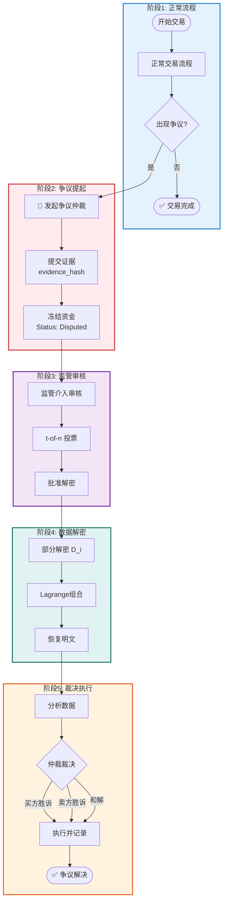

```mermaid
flowchart TD
    subgraph Phase1[" 阶段1: 正常流程 "]
        Start([开始交易]) --> Normal[正常交易流程]
        Normal --> Decision{出现争议?}
        Decision -->|否| Complete([✅ 交易完成])
    end
    
    subgraph Phase2[" 阶段2: 争议提起 "]
        Dispute[🚨 发起争议仲裁]
        Evidence[提交证据<br/>evidence_hash]
        Freeze[冻结资金<br/>Status: Disputed]
        
        Dispute --> Evidence --> Freeze
    end
    
    subgraph Phase3[" 阶段3: 监管审核 "]
        Regulator[监管介入审核]
        Vote[t-of-n 投票]
        Approve[批准解密]
        
        Regulator --> Vote --> Approve
    end
    
    subgraph Phase4[" 阶段4: 数据解密 "]
        Decrypt1[部分解密 D_i]
        Decrypt2[Lagrange组合]
        Decrypt3[恢复明文]
        
        Decrypt1 --> Decrypt2 --> Decrypt3
    end
    
    subgraph Phase5[" 阶段5: 裁决执行 "]
        Analyze[分析数据]
        Ruling{仲裁裁决}
        Execute[执行并记录]
        Resolved([✅ 争议解决])
        
        Analyze --> Ruling
        Ruling -->|买方胜诉| Execute
        Ruling -->|卖方胜诉| Execute
        Ruling -->|和解| Execute
        Execute --> Resolved
    end
    
    Decision -->|是| Dispute
    Freeze --> Regulator
    Approve --> Decrypt1
    Decrypt3 --> Analyze
    
    style Phase1 fill:#e3f2fd,stroke:#1976d2,stroke-width:2px
    style Phase2 fill:#ffebee,stroke:#c62828,stroke-width:2px
    style Phase3 fill:#f3e5f5,stroke:#6a1b9a,stroke-width:2px
    style Phase4 fill:#e0f2f1,stroke:#00695c,stroke-width:2px
    style Phase5 fill:#fff3e0,stroke:#e65100,stroke-width:2px

```