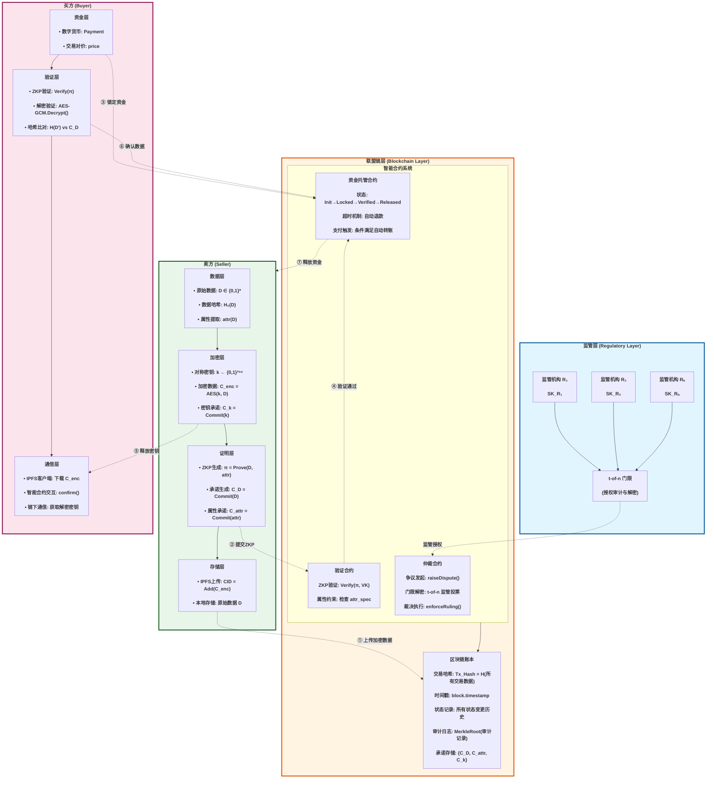

```mermaid
graph TB
    subgraph Regulatory["<b>监管层 (Regulatory Layer)</b>"]
        R1["<b>监管机构 R₁</b><br/><br/>SK_R₁"]
        R2["<b>监管机构 R₂</b><br/><br/>SK_R₂"]
        Rn["<b>监管机构 Rₙ</b><br/><br/>SK_Rₙ"]
        Threshold["<b>t-of-n 门限</b><br/><br/>(授权审计与解密)"]
        R1 --> Threshold
        R2 --> Threshold
        Rn --> Threshold
    end

    subgraph Blockchain["<b>联盟链层 (Blockchain Layer)</b>"]
        subgraph Contracts["<b>智能合约系统</b>"]
            Escrow["<b>资金托管合约</b><br/><br/>状态: Init→Locked→Verified→Released<br/><br/>超时机制: 自动退款<br/><br/>支付触发: 条件满足自动转账"]
            Verification["<b>验证合约</b><br/><br/>ZKP验证: Verify(π, VK)<br/><br/>属性约束: 检查 attr_spec"]
            Arbitration["<b>仲裁合约</b><br/><br/>争议发起: raiseDispute()<br/><br/>门限解密: t-of-n 监管投票<br/><br/>裁决执行: enforceRuling()"]
        end
        
        Ledger["<b>区块链账本</b><br/><br/>交易哈希: Tx_Hash = H(所有交易数据)<br/><br/>时间戳: block.timestamp<br/><br/>状态记录: 所有状态变更历史<br/><br/>审计日志: MerkleRoot(审计记录)<br/><br/>承诺存储: {C_D, C_attr, C_k}"]
        
        Contracts --> Ledger
    end

    subgraph Seller["<b>卖方 (Seller)</b>"]
        S_Data["<b>数据层</b><br/><br/>• 原始数据: D ∈ {0,1}*<br/><br/>• 数据哈希: H₀(D)<br/><br/>• 属性提取: attr(D)"]
        S_Encrypt["<b>加密层</b><br/><br/>• 对称密钥: k ← {0,1}²⁵⁶<br/><br/>• 加密数据: C_enc = AES(k, D)<br/><br/>• 密钥承诺: C_k = Commit(k)"]
        S_Proof["<b>证明层</b><br/><br/>• ZKP生成: π = Prove(D, attr)<br/><br/>• 承诺生成: C_D = Commit(D)<br/><br/>• 属性承诺: C_attr = Commit(attr)"]
        S_Storage["<b>存储层</b><br/><br/>• IPFS上传: CID = Add(C_enc)<br/><br/>• 本地存储: 原始数据 D"]
        
        S_Data --> S_Encrypt
        S_Encrypt --> S_Proof
        S_Proof --> S_Storage
    end

    subgraph Buyer["<b>买方 (Buyer)</b>"]
        B_Payment["<b>资金层</b><br/><br/>• 数字货币: Payment<br/><br/>• 交易对价: price"]
        B_Verify["<b>验证层</b><br/><br/>• ZKP验证: Verify(π)<br/><br/>• 解密验证: AES-GCM.Decrypt()<br/><br/>• 哈希比对: H(D') vs C_D"]
        B_Comm["<b>通信层</b><br/><br/>• IPFS客户端: 下载 C_enc<br/><br/>• 智能合约交互: confirm()<br/><br/>• 链下通信: 获取解密密钥"]
        
        B_Payment --> B_Verify
        B_Verify --> B_Comm
    end

    Threshold -.->|"<b>监管授权</b>"| Arbitration
    S_Storage -.->|"<b>① 上传加密数据</b>"| Ledger
    S_Proof -.->|"<b>② 提交ZKP</b>"| Verification
    B_Payment -.->|"<b>③ 锁定资金</b>"| Escrow
    Verification -.->|"<b>④ 验证通过</b>"| Escrow
    S_Encrypt -.->|"<b>⑤ 释放密钥</b>"| B_Comm
    B_Verify -.->|"<b>⑥ 确认数据</b>"| Escrow
    Escrow -.->|"<b>⑦ 释放资金</b>"| Seller

    style Regulatory fill:#e1f5ff,stroke:#01579b,stroke-width:3px
    style Blockchain fill:#fff4e1,stroke:#e65100,stroke-width:3px
    style Seller fill:#e8f5e9,stroke:#1b5e20,stroke-width:3px
    style Buyer fill:#fce4ec,stroke:#880e4f,stroke-width:3px
    
    classDef largeText font-size:16px,font-weight:bold
    class R1,R2,Rn,Threshold,Escrow,Verification,Arbitration,Ledger,S_Data,S_Encrypt,S_Proof,S_Storage,B_Payment,B_Verify,B_Comm largeText

```