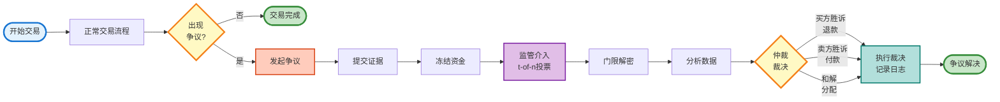

```mermaid
flowchart LR
    Start([开始交易])
    Normal[正常交易流程]
    Decision{出现<br/>争议?}
    Complete([交易完成])
    
    Dispute[发起争议]
    Evidence[提交证据]
    Freeze[冻结资金]
    Regulator[监管介入<br/>t-of-n投票]
    Decrypt[门限解密]
    Analyze[分析数据]
    Ruling{仲裁<br/>裁决}
    Execute[执行裁决<br/>记录日志]
    Resolved([争议解决])
    
    Start --> Normal --> Decision
    Decision -->|否| Complete
    Decision -->|是| Dispute --> Evidence --> Freeze
    Freeze --> Regulator --> Decrypt --> Analyze --> Ruling
    
    Ruling -->|买方胜诉<br/>退款| Execute
    Ruling -->|卖方胜诉<br/>付款| Execute
    Ruling -->|和解<br/>分配| Execute
    
    Execute --> Resolved
    
    style Start fill:#e3f2fd,stroke:#1976d2,stroke-width:3px
    style Complete fill:#c8e6c9,stroke:#388e3c,stroke-width:3px
    style Decision fill:#fff9c4,stroke:#f57f17,stroke-width:3px
    style Dispute fill:#ffccbc,stroke:#d84315,stroke-width:2px
    style Regulator fill:#e1bee7,stroke:#7b1fa2,stroke-width:2px
    style Ruling fill:#fff9c4,stroke:#f57f17,stroke-width:3px
    style Execute fill:#b2dfdb,stroke:#00796b,stroke-width:2px
    style Resolved fill:#c8e6c9,stroke:#388e3c,stroke-width:3px

```