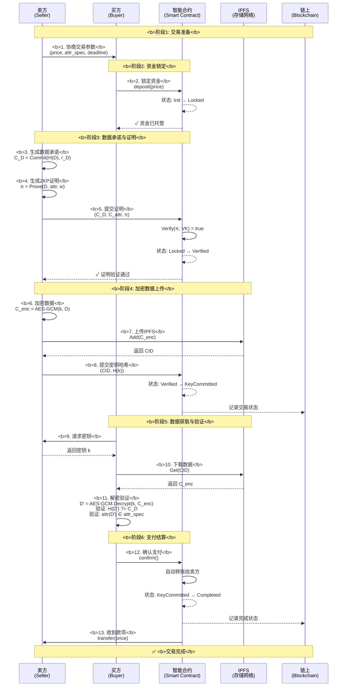

```mermaid
sequenceDiagram
    participant Seller as 卖方<br/>(Seller)
    participant Buyer as 买方<br/>(Buyer)
    participant Contract as 智能合约<br/>(Smart Contract)
    participant IPFS as IPFS<br/>(存储网络)
    participant Chain as 链上<br/>(Blockchain)

    Note over Seller,Chain: <b>阶段1: 交易准备</b>
    Seller->>Buyer: <b>1. 协商交易参数</b><br/>(price, attr_spec, deadline)
    
    Note over Buyer,Contract: <b>阶段2: 资金锁定</b>
    Buyer->>Contract: <b>2. 锁定资金</b><br/>deposit(price)
    Contract-->>Contract: 状态: Init → Locked
    Contract-->>Buyer: ✓ 资金已托管
    
    Note over Seller,Contract: <b>阶段3: 数据承诺与证明</b>
    Seller->>Seller: <b>3. 生成数据承诺</b><br/>C_D = Commit(H(D), r_D)
    Seller->>Seller: <b>4. 生成ZKP证明</b><br/>π = Prove(D, attr, w)
    
    Seller->>Contract: <b>5. 提交证明</b><br/>(C_D, C_attr, π)
    Contract->>Contract: Verify(π, VK) = true
    Contract-->>Contract: 状态: Locked → Verified
    Contract-->>Seller: ✓ 证明验证通过
    
    Note over Seller,IPFS: <b>阶段4: 加密数据上传</b>
    Seller->>Seller: <b>6. 加密数据</b><br/>C_enc = AES-GCM(k, D)
    Seller->>IPFS: <b>7. 上传IPFS</b><br/>Add(C_enc)
    IPFS-->>Seller: 返回 CID
    
    Seller->>Contract: <b>8. 提交密钥哈希</b><br/>(CID, H(k))
    Contract-->>Contract: 状态: Verified → KeyCommitted
    Contract-->>Chain: 记录交易状态
    
    Note over Buyer,IPFS: <b>阶段5: 数据获取与验证</b>
    Buyer->>Seller: <b>9. 请求密钥</b>
    Seller-->>Buyer: 返回密钥 k
    
    Buyer->>IPFS: <b>10. 下载数据</b><br/>Get(CID)
    IPFS-->>Buyer: 返回 C_enc
    
    Buyer->>Buyer: <b>11. 解密验证</b><br/>D' = AES-GCM.Decrypt(k, C_enc)<br/>验证: H(D') ?= C_D<br/>验证: attr(D') ∈ attr_spec
    
    Note over Buyer,Contract: <b>阶段6: 支付结算</b>
    Buyer->>Contract: <b>12. 确认支付</b><br/>confirm()
    Contract->>Contract: 自动转账给卖方
    Contract-->>Contract: 状态: KeyCommitted → Completed
    Contract-->>Chain: 记录完成状态
    
    Contract->>Seller: <b>13. 收到款项</b><br/>transfer(price)
    
    Note over Seller,Chain: ✅ <b>交易完成</b>

```