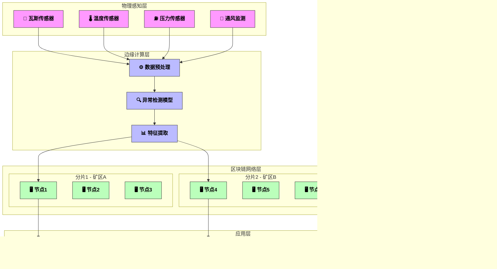

```mermaid
graph TB
    %% 整体方向
    classDef sensor fill:#f9f,stroke:#333,stroke-width:1px,color:#000,font-weight:bold
    classDef edge fill:#bbf,stroke:#333,stroke-width:1px,color:#000,font-weight:bold
    classDef blockchain fill:#bfb,stroke:#333,stroke-width:1px,color:#000,font-weight:bold
    classDef app fill:#ffb,stroke:#333,stroke-width:1px,color:#000,font-weight:bold

    subgraph "物理感知层"
        S1[📡 瓦斯传感器]
        S2[🌡 温度传感器]
        S3[⛽ 压力传感器]
        S4[💨 通风监测]
    end
    
    subgraph "边缘计算层"
        M1[⚙️ 数据预处理]
        M2[🔍 异常检测模型]
        M3[📊 特征提取]
    end
    
    subgraph "区块链网络层"
        subgraph "分片1 - 矿区A"
            N1[🖥 节点1]
            N2[🖥 节点2]
            N3[🖥 节点3]
        end
        
        subgraph "分片2 - 矿区B"
            N4[🖥 节点4]
            N5[🖥 节点5]
            N6[🖥 节点6]
        end
        
        subgraph "分片N - 监管机构"
            N7[⚖️ 监管节点1]
            N8[⚖️ 监管节点2]
        end
    end
    
    subgraph "应用层"
        C1[📺 实时监控]
        C2[🚨 预警系统]
        C3[📑 审计追溯]
        C4[📈 报表分析]
    end
    
    %% 连线
    S1 --> M1
    S2 --> M1
    S3 --> M1
    S4 --> M1
    
    M1 --> M2
    M2 --> M3
    M3 --> N1
    M3 --> N4
    
    N1 --> C1
    N4 --> C2
    N7 --> C3
    N8 --> C4
    
    %% 分类样式
    class S1,S2,S3,S4 sensor
    class M1,M2,M3 edge
    class N1,N2,N3,N4,N5,N6,N7,N8 blockchain
    class C1,C2,C3,C4 app

```